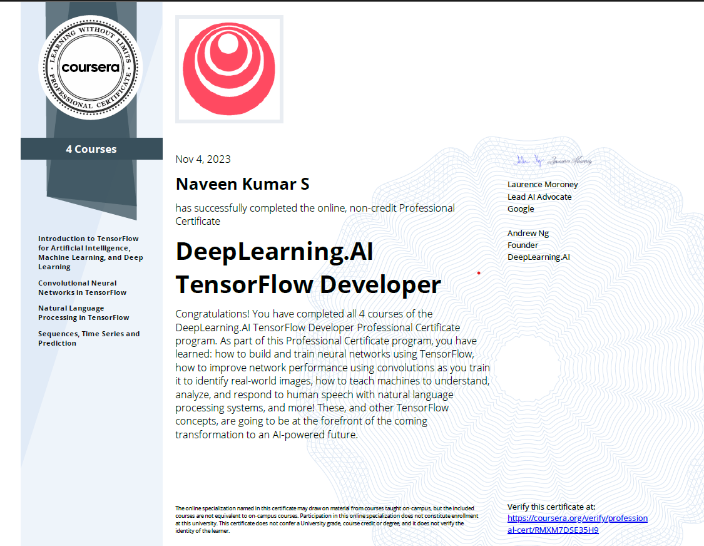

# DeepLearning.AI TensorFlow Developer Professional Certificate

## Instructed by :   [ Laurence Moroney](https://laurencemoroney.com/about.html)
## Offered by 

[DeepLearning.AI TensorFlow Developer Professional Certificate on Coursera](https://www.coursera.org/professional-certificates/tensorflow-in-practice)

---

## Courses and Certificates
  - [Introduction to TensorFlow for Artificial Intelligence, Machine Learning, and Deep Learning]() 

    
Show Certificate

      

  

  - [Convolutional Neural Networks in TensorFlow]() 

    
Show Certificate

      

  

  - [Natural Language Processing in TensorFlow]() 

    
Show Certificate

      

  

  - [Sequences, Time Series and Prediction]() 

    
Show Certificate

      

  

# DeepLearning.AI_Professional_Certificate_Programme
