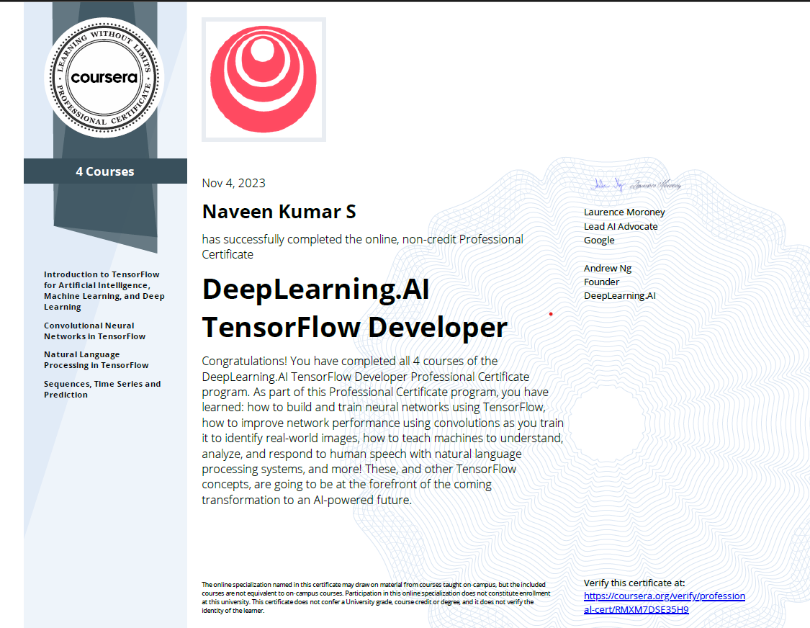

# DeepLearning.AI TensorFlow Developer Professional Certificate

## Instructed by :   [ Laurence Moroney](https://laurencemoroney.com/about.html)
## Offered by 

[DeepLearning.AI TensorFlow Developer Professional Certificate on Coursera](https://www.coursera.org/professional-certificates/tensorflow-in-practice)

---

## Courses and Certificates
  - [Introduction to TensorFlow for Artificial Intelligence, Machine Learning, and Deep Learning](https://github.com/naveenkumar12624/DeepLearning.AI_Professional_Certificate_Programme/tree/main/1.%20Introduction%20to%20TensorFlow%20for%20Artificial%20Intelligence%2C%20Machine%20Learning%2C%20and%20Deep%20Learning) 

    
Show Certificate

      

  

  - [Convolutional Neural Networks in TensorFlow](https://github.com/naveenkumar12624/DeepLearning.AI_Professional_Certificate_Programme/tree/main/2.%20Convolutional%20Neural%20Networks%20in%20TensorFlow) 

    
Show Certificate

      

  

  - [Natural Language Processing in TensorFlow](https://github.com/naveenkumar12624/DeepLearning.AI_Professional_Certificate_Programme/tree/main/3.%20Natural%20Language%20Processing%20in%20TensorFlow) 

    
Show Certificate

      

  

  - [Sequences, Time Series and Prediction](https://github.com/naveenkumar12624/DeepLearning.AI_Professional_Certificate_Programme/tree/main/4.%20Sequences%2C%20Time%20Serirs%20and%20Prediction) 

    
Show Certificate

      

  

# DeepLearning.AI_Professional_Certificate_Programme
